# Tanya Ulama

Platform tanya jawab islami yang menghubungkan masyarakat dengan ustaz dan ustazah terpercaya. Pengguna dapat mengajukan pertanyaan secara anonim dan mendapatkan jawaban dari para ahli agama yang telah terverifikasi.

## Fitur

- **Tanya Jawab Anonim** — Pengguna dapat mengajukan pertanyaan tanpa identitas terungkap
- **Verifikasi Ustaz** — Ustaz dan ustazah harus mengunggah dokumen verifikasi sebelum dapat menjawab
- **Sistem Laporan** — Ustaz dan ustazah dapat melaporkan pertanyaan yang tidak pantas dan jawaban yang tidak tepat.
- **Dashboard Admin** — Admin dapat mengelola verifikasi, laporan, dan pengguna
- **Search** — Pencarian pertanyaan dan ustaz/ustazah

## Tech Stack

- **Backend** — Laravel 11
- **Frontend** — Livewire v4, Alpine.js, Tailwind CSS v4
- **UI Components** — Flux UI
- **Rich Text Editor** — Quill.js
- **Role & Permission** — Spatie Laravel Permission
- **Database** — sqlite

## Instalasi

### Prasyarat
- PHP >= 8.2
- Composer
- Node.js & NPM

### Langkah Instalasi

**1. Clone repository**
```bash
git clone https://github.com/username/tanya-ulama.git
cd tanya-ulama
```

**2. Install dependencies**
```bash
composer install
npm install
```

**3. Konfigurasi environment**
```bash
cp .env.example .env
php artisan key:generate
```

**4. Konfigurasi database di `.env`**
```env
DB_CONNECTION=sqlite
```

**5. Migrasi dan seeder**
```bash
php artisan migrate
php artisan db:seed --class=RoleSeeder
php artisan db:seed --class=UserSeeder
php artisan db:seed --class=UstazSeeder
```

**6. Storage link**
```bash
php artisan storage:link
```

**7. Build assets**
```bash
npm run dev
```

**8. Jalankan server**
```bash
composer run dev
```

Akses aplikasi di `http://localhost:8000`

## Peran Pengguna

| Peran | Kemampuan |
|---|---|
| **User** | Mengajukan pertanyaan, melihat jawaban|
| **Ustaz/Ustazah** | Menjawab pertanyaan (setelah terverifikasi), melaporkan konten |
| **Admin** | Mengelola verifikasi, laporan, dan daftar pengguna |

## Seeder

```bash
# Seeder pertanyaan (25 pertanyaan)
php artisan db:seed --class=QuestionSeeder
```

## Struktur Role

- `admin` — Akses penuh ke dashboard admin
- `ustaz` — Ustaz laki-laki yang telah terverifikasi
- `ustazah` — Ustazah perempuan yang telah terverifikasi
- `user` — Pengguna umum

## Screenshots
### Tampilan log in
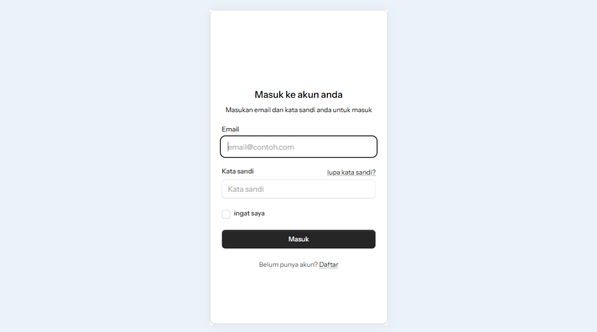

### Tampilan sign up pengguna
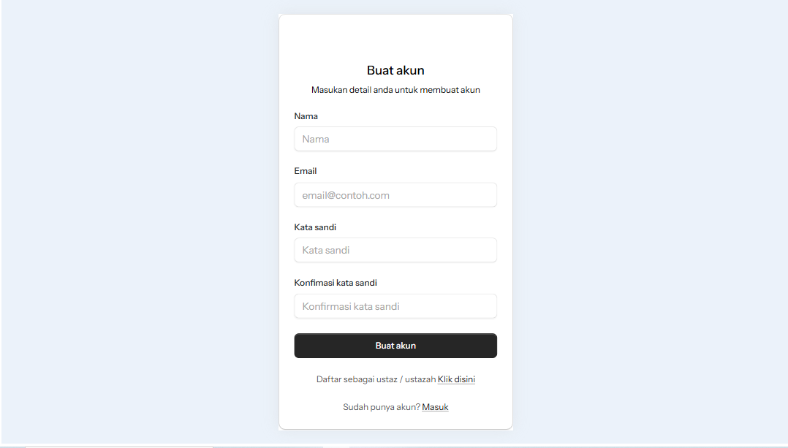

### Tampilan sign up sebagai ustaz atau ustazah
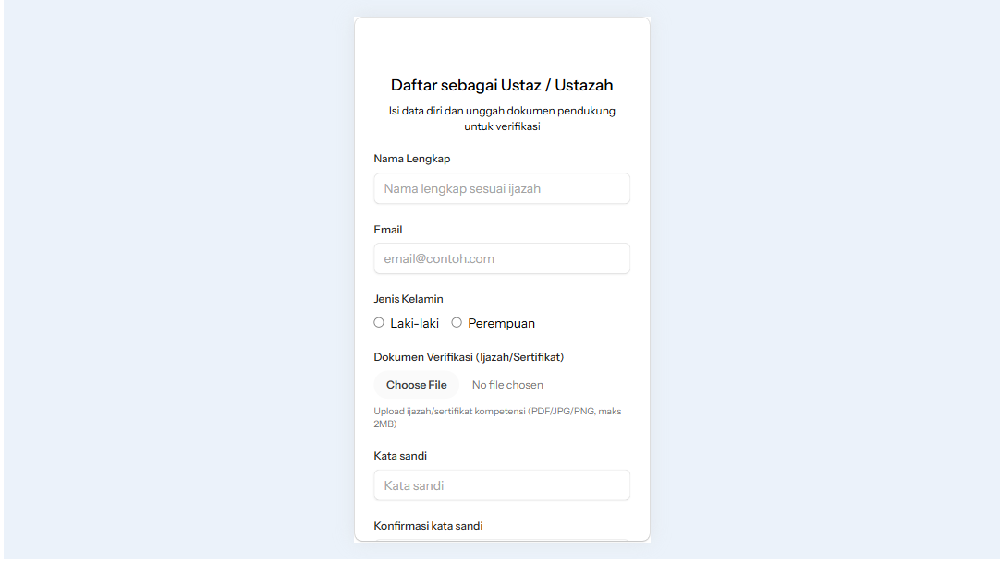

### Tampilan pertanyaan
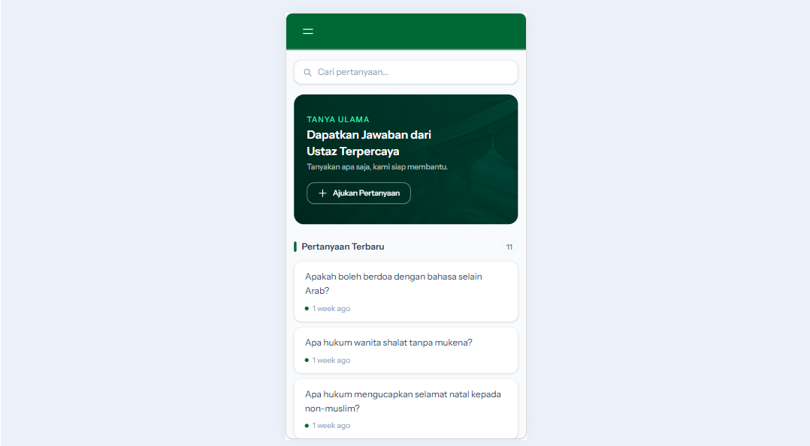

### Tampilan buat pertanyaan
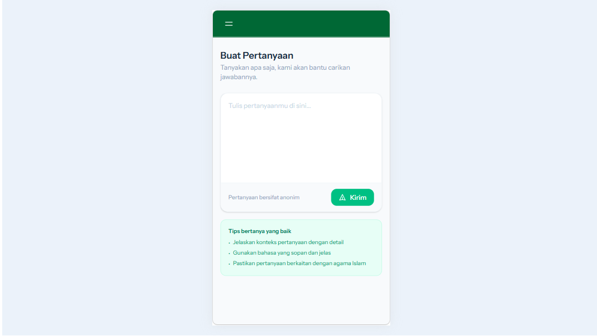

### Tampilan detail pertanyaan
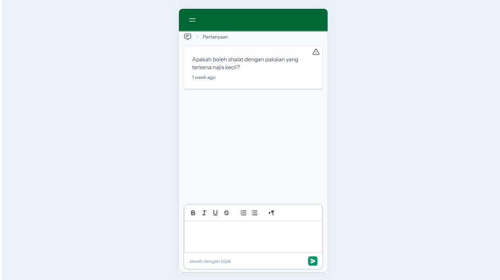

### Tampilan pertanyaan yang sudah dijawab
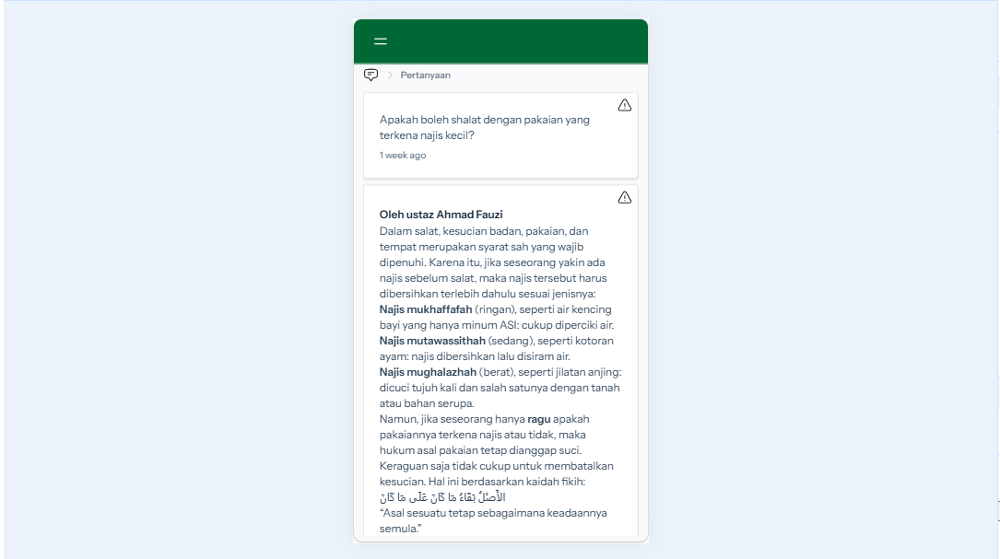

### Tampilan report
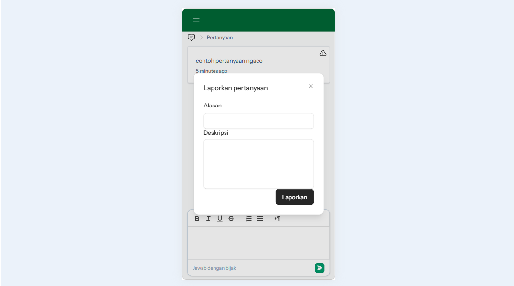

### Tampilan daftar pertanyaan yang dibuat pengguna
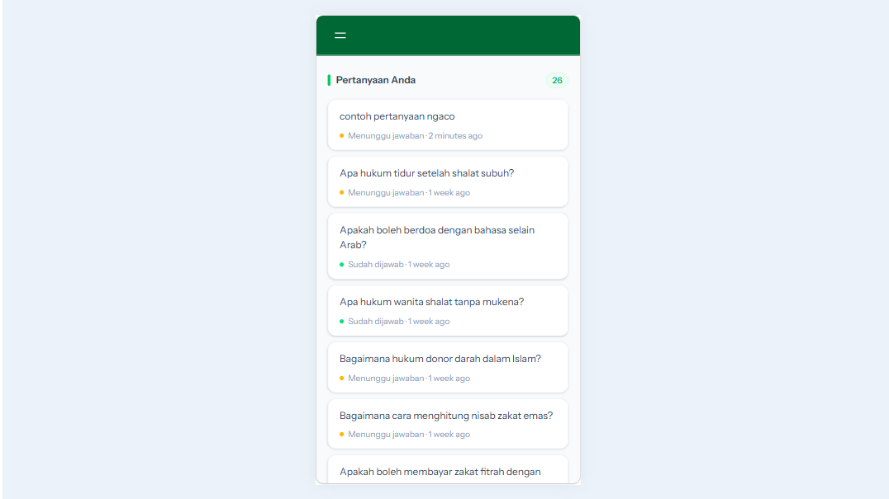

### Tampilan dashboard
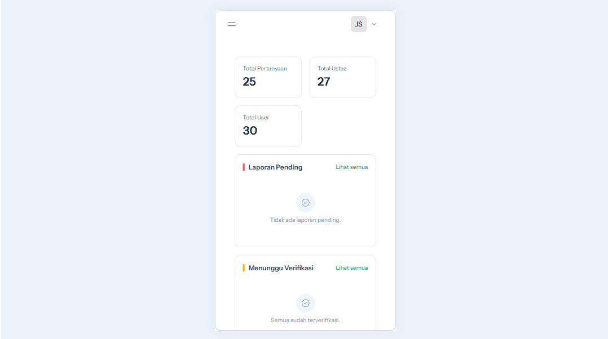

### Tampilan daftar pengguna
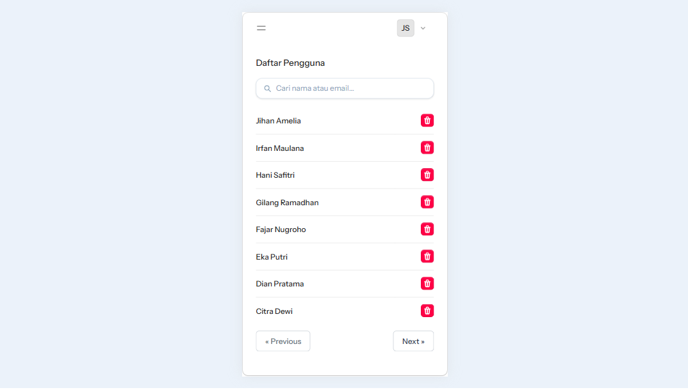

### Tampilan daftar ustaz dan ustazah
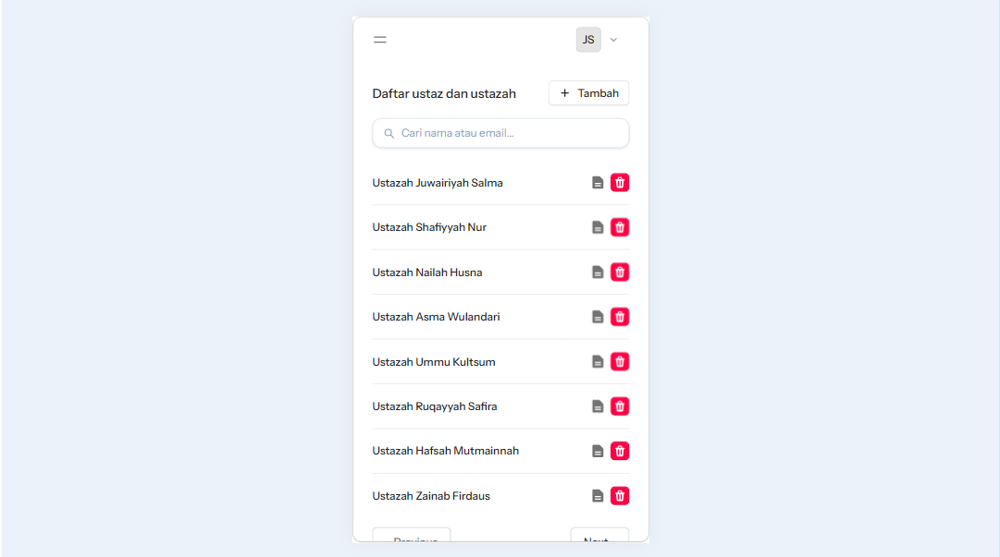

### Tampilan daftar verifikasi ustaz dan ustazah
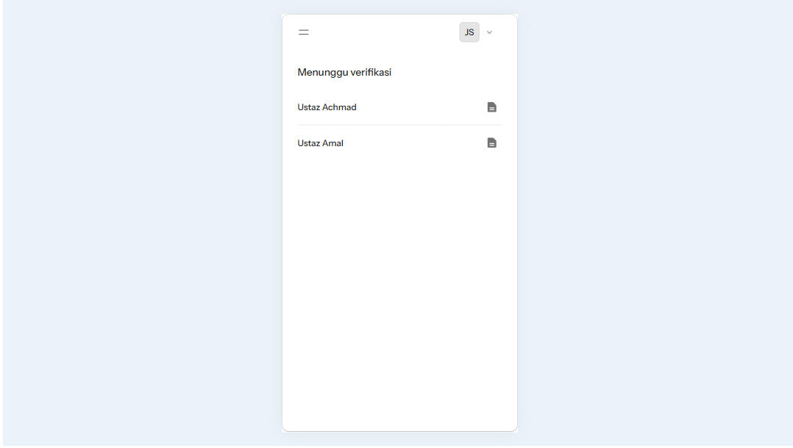

### Tampilan verifikasi ustaz dan ustazah
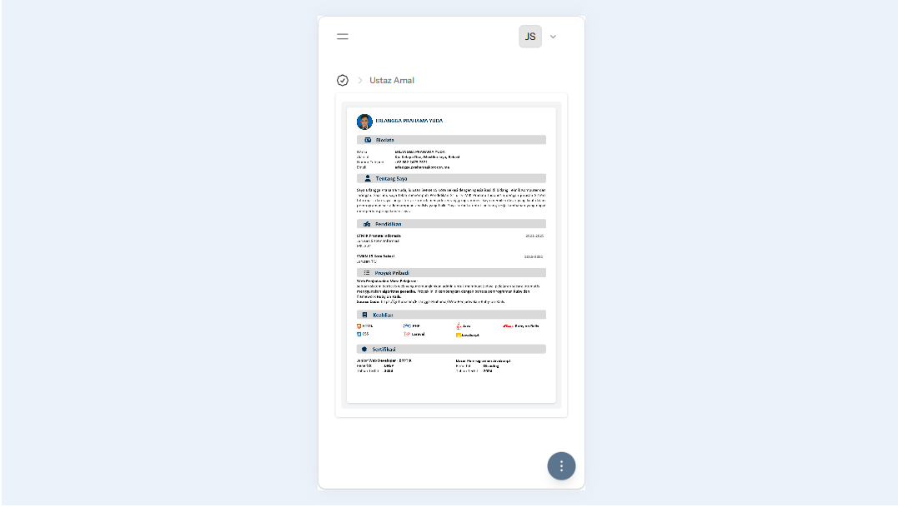

### Tampilan daftar laporan
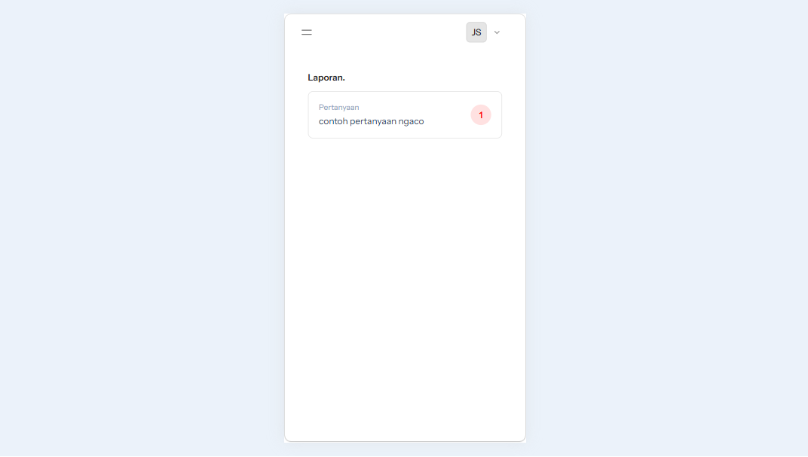

### Tampilan detail laporan
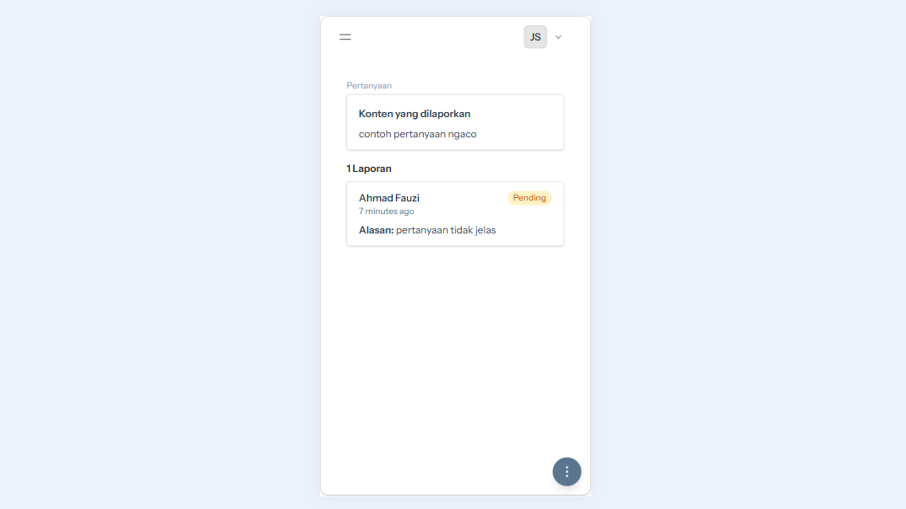

### Tampilan daftar pelanggar
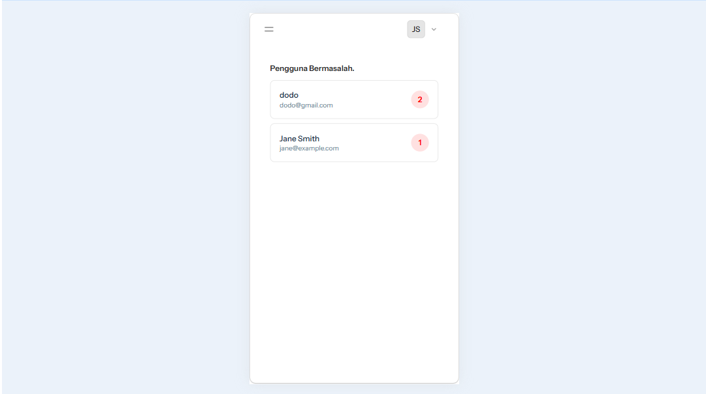

## Lisensi

MIT License
